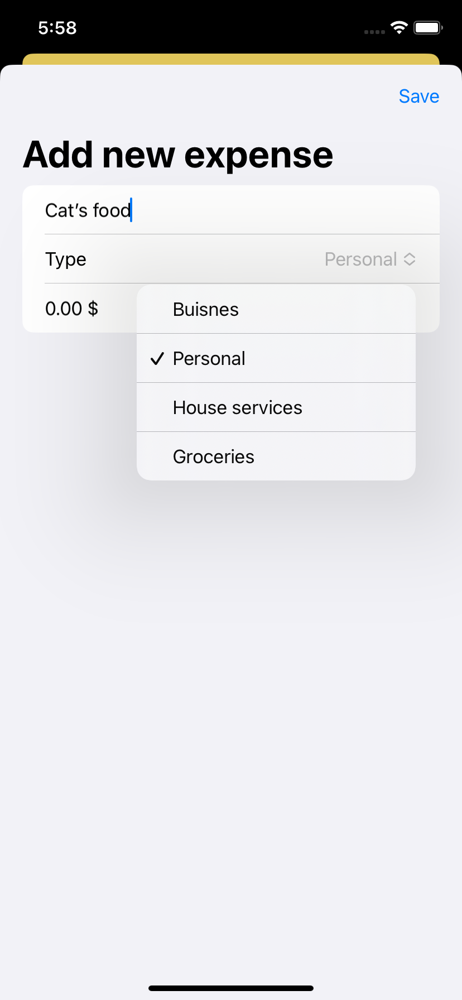

# Expenses_App

## A simple expenses count app with the following features:
- Adding expense items
- Delete unnecessary expense items
- Simple UI

## Stack used:
- SwiftUI
- Architecture: clean MVVM
- Combine observation features (@ObservableObjects/@Published)
  

  
  
  

